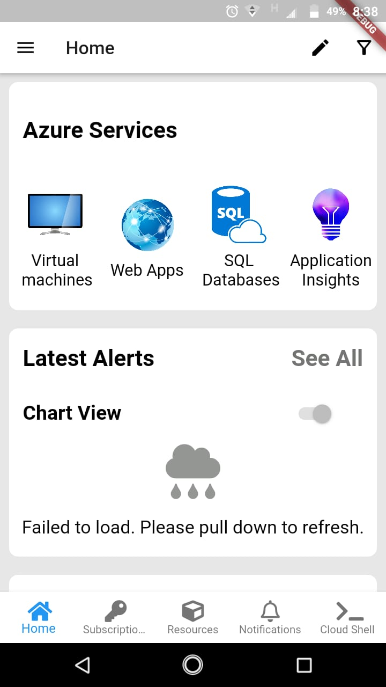
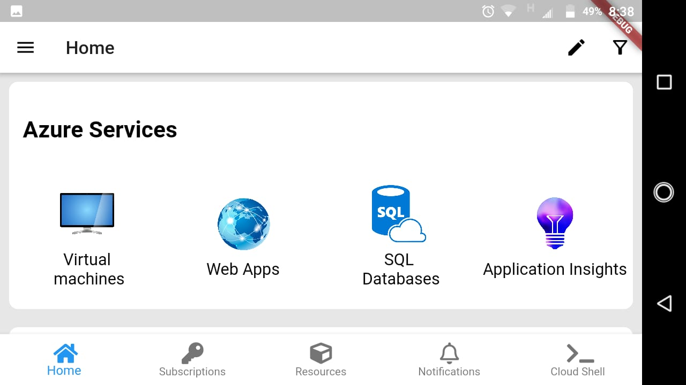
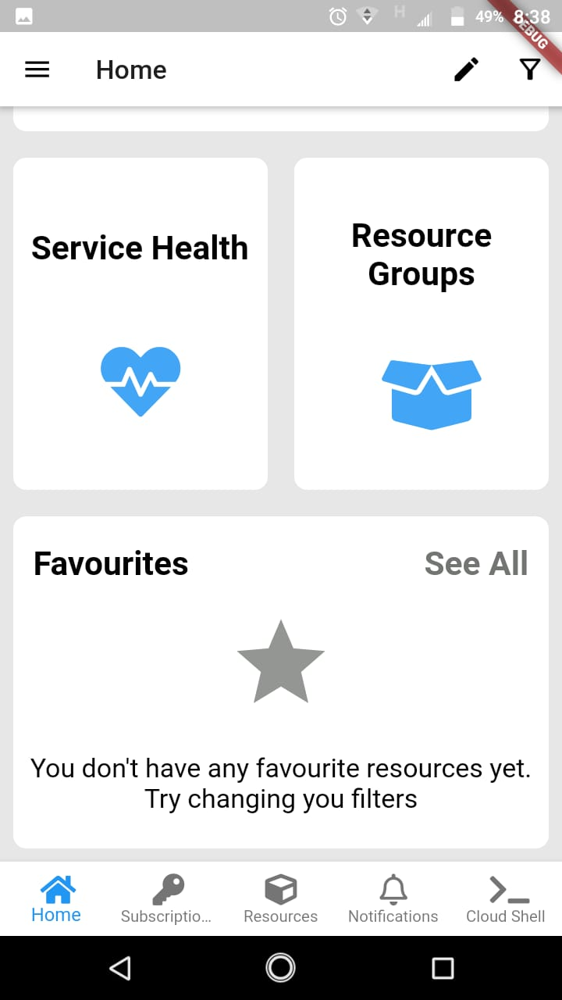

# challenge_screen2

A new Flutter project.

## dependencies:
- font_awesome_flutter: ^8.11.0

I am new to flutter and I created this project just by waching the image provided by Flutter karachi team.
## Azure cloud service Clone UI

This project is a starting point for a Flutter application.

I have used reusable widgets :

- Used Reusable widgets.
- Media query for responsivness
- List view for scrolling.
- Other requirments are also added.

## Installation process just clone the repo and copy the images and lib folder to your project.

## First output

## Second output

## Third output

For help getting started with Flutter, view our
[online documentation](https://flutter.dev/docs), which offers tutorials,
samples, guidance on mobile development, and a full API reference.
